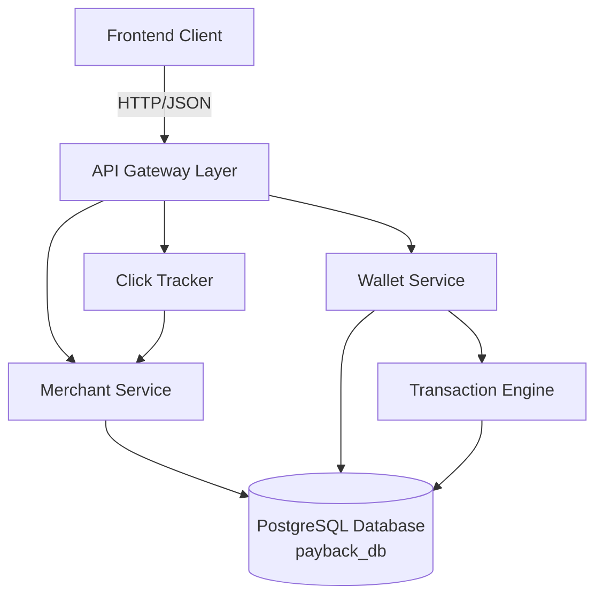
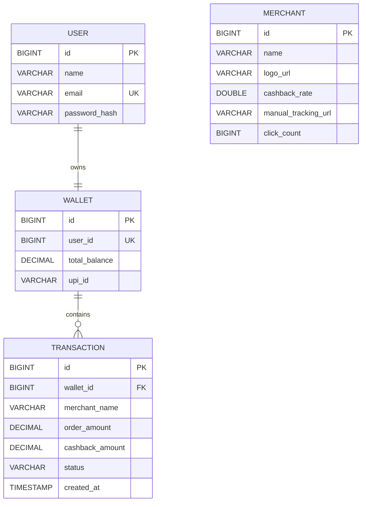
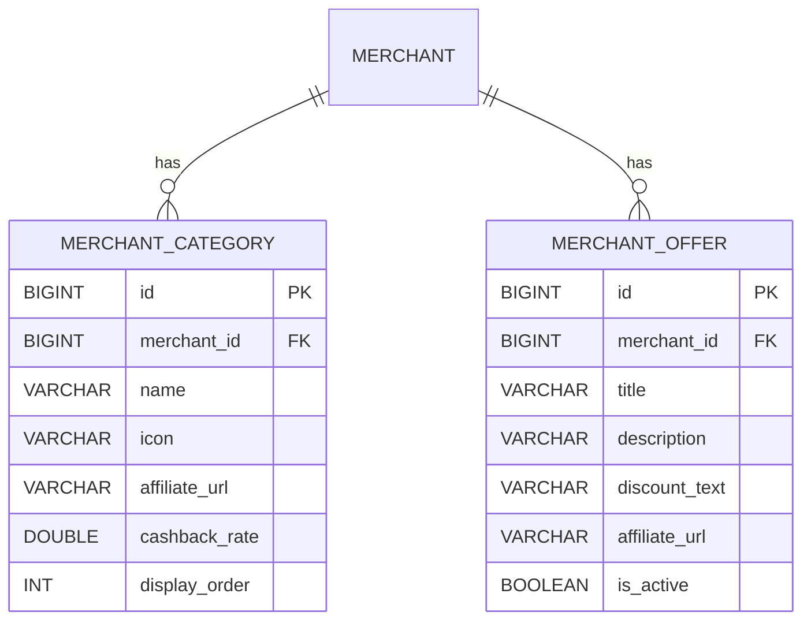

# Design Document: Merchant & Wallet Service

## Overview

The Merchant & Wallet Service is the core backend engine for PayBack India, a cashback aggregator platform targeting the Indian e-commerce market. This service provides four primary capabilities:

1. **Merchant Management**: Store and retrieve merchant information with popularity-based sorting
2. **Click Tracking**: Monitor user engagement with merchant affiliate links
3. **Wallet & Transaction System**: Track cashback earnings with detailed transaction history
4. **Authentication**: Stateless JWT-based user registration and login

The system follows a transaction-based wallet model where each purchase creates an individual transaction record, enabling users to see detailed history of every cashback earning. Transactions progress through states (PENDING → CONFIRMED/REJECTED) that determine when cashback becomes available for withdrawal.

This design implements a RESTful JSON API using Spring Boot 3.2, Spring Data JPA, and the EXISTING PostgreSQL database `payback_db` (configured in `payback-api/src/main/resources/application.properties`), with seed data initialization for immediate testing capability.

### Transaction Entity: Critical Component for "Individual Record" Rule

The Transaction entity is a critical database component that implements the "Individual Record" Rule from the PRD. This is a SEPARATE database table (`transactions`) that maintains referential integrity with the Wallet table through a foreign key constraint.

Each Transaction record captures:
- Link to parent Wallet (via `wallet_id` foreign key)
- Merchant name (denormalized for query performance)
- Order amount and calculated cashback amount
- Status lifecycle (PENDING → CONFIRMED/REJECTED)
- Creation timestamp for chronological ordering

This design ensures users can view complete purchase history with full transaction lifecycle tracking, satisfying the core requirement that "users must be able to see a detailed history of every purchase."

## Architecture

### Database Configuration

This service uses the EXISTING PostgreSQL database `payback_db` that is already configured in the application:

- **Database Name**: `payback_db`
- **Connection URL**: `jdbc:postgresql://localhost:5432/payback_db`
- **Username**: `admin`
- **Password**: `password123`
- **Configuration File**: `payback-api/src/main/resources/application.properties`
- **Schema Management**: Hibernate DDL auto-update mode (preserves existing data)

The service will create three new tables in this existing database:
- `merchants` - Stores merchant information and click counts
- `wallets` - Stores user wallet balances and UPI identifiers
- `transactions` - Stores individual transaction records with foreign key to wallets

All data persistence operations use Spring Data JPA with the configured PostgreSQL connection.

### System Components



### Layered Architecture

The system follows Spring Boot's standard layered architecture:

**Controller Layer** (`com.payback.api.controller`)
- Handles HTTP requests and responses
- Validates request parameters
- Maps between DTOs and domain models
- Returns appropriate HTTP status codes

**Service Layer** (`com.payback.api.service`)
- Implements business logic
- Orchestrates operations across repositories
- Handles transaction management
- Performs calculations (balance, cashback amounts)

**Repository Layer** (`com.payback.api.repository`)
- Extends Spring Data JPA repositories
- Provides data access abstractions
- Defines custom query methods

**Entity Layer** (`com.payback.api.entity`)
- JPA entities mapped to database tables
- Defines relationships and constraints
- Uses Lombok for boilerplate reduction

**DTO Layer** (`com.payback.api.dto`)
- Data transfer objects for API requests/responses
- Decouples internal models from API contracts

### Data Flow Patterns

**Merchant Listing Flow**:
```
Client → GET /api/v1/merchants → MerchantController → MerchantService 
→ MerchantRepository.findAllByOrderByClickCountDesc() → Database
→ List<Merchant> → MerchantService → List<MerchantDTO> → JSON Response
```

**Click Tracking Flow**:
```
Client → POST /api/v1/merchants/{id}/click → MerchantController 
→ MerchantService.incrementClickCount(id) → MerchantRepository.findById()
→ merchant.clickCount++ → MerchantRepository.save() → Database → 200 OK
```

**Wallet Retrieval Flow**:
```
Client → GET /api/v1/wallet/{userId} → WalletController → WalletService
→ WalletRepository.findByUserId() → TransactionRepository.findByWalletOrderByCreatedAtDesc()
→ Calculate balances → WalletResponseDTO → JSON Response
```

## Components and Interfaces

### REST API Endpoints

#### Merchant Endpoints

**GET /api/v1/merchants**
- Description: Retrieve all merchants sorted by popularity
- Request: None
- Response: `200 OK`
```json
[
  {
    "id": 1,
    "name": "Flipkart",
    "logoUrl": "https://example.com/flipkart.png",
    "cashbackRate": 10.0,
    "manualTrackingUrl": "https://tracking.example.com/flipkart",
    "clickCount": 150
  }
]
```

**POST /api/v1/merchants/{id}/click**
- Description: Increment click count for a merchant
- Request: Path parameter `id` (Long)
- Response: `200 OK` (empty body) or `404 Not Found`

#### Auth Endpoints

**POST /api/v1/transactions**
- Description: Create a PENDING transaction for the authenticated user when they click through to a merchant
- Request: `Authorization: Bearer <token>` header required
- Request body: `{ "merchantId": 1, "orderAmount": 2000.00 }`
- Response: `201 Created`
```json
{
  "id": 5,
  "merchantName": "Flipkart",
  "orderAmount": 2000.00,
  "cashbackAmount": 200.00,
  "status": "PENDING",
  "createdAt": "2026-03-17T10:30:00"
}
```
- Error: `404 Not Found` if merchantId or user wallet does not exist
- Error: `401 Unauthorized` if JWT is missing or invalid

#### Auth Endpoints

**POST /api/v1/auth/register**
- Description: Register a new user account
- Request body: `{ "name": "string", "email": "string", "password": "string" }`
- Response: `201 Created`
```json
{
  "token": "eyJhbGci...",
  "user": { "id": 1, "name": "Alice", "email": "alice@example.com" }
}
```
- Error: `400 Bad Request` if email already registered

**POST /api/v1/auth/login**
- Description: Authenticate an existing user
- Request body: `{ "email": "string", "password": "string" }`
- Response: `200 OK` (same shape as register) or `400 Bad Request` if credentials invalid

#### Wallet Endpoints

**GET /api/v1/wallet/me**
- Description: Retrieve wallet for the authenticated user (requires JWT)
- Request: `Authorization: Bearer <token>` header
- Response: `200 OK` (same shape as below) or `401 Unauthorized`

**GET /api/v1/wallet/{userId}**
- Description: Retrieve wallet details and transaction history (public, backward-compatible)
- Request: Path parameter `userId` (Long)
- Response: `200 OK` or `404 Not Found`
```json
{
  "userId": 1,
  "totalBalance": 500.00,
  "upiId": "user@paytm",
  "totalEarned": 750.00,
  "pendingAmount": 250.00,
  "availableBalance": 500.00,
  "transactions": [
    {
      "id": 1,
      "merchantName": "Flipkart",
      "orderAmount": 2000.00,
      "cashbackAmount": 200.00,
      "status": "CONFIRMED",
      "createdAt": "2025-01-15T10:30:00"
    }
  ]
}
```

### Service Interfaces

#### AuthService

```java
public interface AuthService {
    AuthResponseDTO register(RegisterRequestDTO request);
    AuthResponseDTO login(LoginRequestDTO request);
}
```

**Responsibilities**:
- Validate uniqueness of email on registration
- Hash passwords with BCrypt before persistence
- Issue signed JWT tokens (HS256, 24 h expiry) containing userId, email, name
- Verify credentials on login without revealing which field failed
- Auto-create a wallet for every newly registered user

#### MerchantService

```java
public interface MerchantService {
    List<MerchantDTO> getAllMerchants();
    void incrementClickCount(Long merchantId);
    void initializeSeedData();
}
```

**Responsibilities**:
- Retrieve merchants ordered by click count
- Atomically increment click counts
- Initialize three seed merchants on startup

#### WalletService

```java
public interface WalletService {
    WalletResponseDTO getWalletByUserId(Long userId);
    Wallet createWallet(Long userId, String upiId);
    void initializeSeedData();
}
```

**Responsibilities**:
- Retrieve wallet with calculated balances
- Create new wallets with zero balance
- Calculate total earned, pending, and available amounts
- Initialize seed wallet on startup

#### TransactionService

```java
public interface TransactionService {
    Transaction createTransaction(Long walletId, String merchantName, 
                                  BigDecimal orderAmount, BigDecimal cashbackAmount);
    void updateTransactionStatus(Long transactionId, TransactionStatus newStatus);
    List<TransactionDTO> getTransactionsByWallet(Long walletId);
    void initializeSeedData();
}
```

**Responsibilities**:
- Create transactions with PENDING status
- Update transaction status and trigger balance updates
- Retrieve transactions ordered by creation time
- Initialize seed transactions on startup

### Repository Interfaces

```java
public interface MerchantRepository extends JpaRepository<Merchant, Long> {
    List<Merchant> findAllByOrderByClickCountDesc();
}

public interface WalletRepository extends JpaRepository<Wallet, Long> {
    Optional<Wallet> findByUserId(Long userId);
}

public interface TransactionRepository extends JpaRepository<Transaction, Long> {
    List<Transaction> findByWalletOrderByCreatedAtDesc(Wallet wallet);
    List<Transaction> findByWalletAndStatus(Wallet wallet, TransactionStatus status);
}
```

## Data Models

### Entity Relationship Diagram



### Entity Specifications

#### User Entity

```java
@Entity
@Table(name = "users")
@Data
@NoArgsConstructor
@AllArgsConstructor
public class User {
    @Id
    @GeneratedValue(strategy = GenerationType.IDENTITY)
    private Long id;

    @Column(nullable = false)
    private String name;

    @Column(nullable = false, unique = true)
    private String email;

    @Column(name = "password_hash", nullable = false)
    private String passwordHash;
}
```

**Constraints**:
- `id`: Primary key, auto-generated
- `email`: Required, unique constraint enforced
- `passwordHash`: Required, stored as BCrypt hash — never plaintext

#### Merchant Entity

```java
@Entity
@Table(name = "merchants")
@Data
@NoArgsConstructor
@AllArgsConstructor
public class Merchant {
    @Id
    @GeneratedValue(strategy = GenerationType.IDENTITY)
    private Long id;
    
    @Column(nullable = false)
    private String name;
    
    @Column(name = "logo_url")
    private String logoUrl;
    
    @Column(name = "cashback_rate", nullable = false)
    private Double cashbackRate;
    
    @Column(name = "manual_tracking_url")
    private String manualTrackingUrl;
    
    @Column(name = "click_count", nullable = false)
    private Long clickCount = 0L;
}
```

**Constraints**:
- `id`: Primary key, auto-generated
- `name`: Required, no uniqueness constraint
- `cashbackRate`: Required, stored as percentage (e.g., 10.0 for 10%)
- `clickCount`: Required, defaults to 0

#### Wallet Entity

```java
@Entity
@Table(name = "wallets")
@Data
@NoArgsConstructor
@AllArgsConstructor
public class Wallet {
    @Id
    @GeneratedValue(strategy = GenerationType.IDENTITY)
    private Long id;
    
    @Column(name = "user_id", nullable = false, unique = true)
    private Long userId;
    
    @Column(name = "total_balance", nullable = false, precision = 10, scale = 2)
    private BigDecimal totalBalance = BigDecimal.ZERO;
    
    @Column(name = "upi_id")
    private String upiId;
    
    @OneToMany(mappedBy = "wallet", cascade = CascadeType.ALL, fetch = FetchType.LAZY)
    private List<Transaction> transactions = new ArrayList<>();
}
```

**Constraints**:
- `id`: Primary key, auto-generated
- `userId`: Required, unique constraint enforced
- `totalBalance`: Required, defaults to 0.00, precision 10 scale 2
- `upiId`: Optional (for future withdrawal feature)

#### Transaction Entity

```java
@Entity
@Table(name = "transactions")
@Data
@NoArgsConstructor
@AllArgsConstructor
public class Transaction {
    @Id
    @GeneratedValue(strategy = GenerationType.IDENTITY)
    private Long id;
    
    @ManyToOne(fetch = FetchType.LAZY, optional = false)
    @JoinColumn(name = "wallet_id", nullable = false)
    private Wallet wallet;
    
    @Column(name = "merchant_name", nullable = false)
    private String merchantName;
    
    @Column(name = "order_amount", nullable = false, precision = 10, scale = 2)
    private BigDecimal orderAmount;
    
    @Column(name = "cashback_amount", nullable = false, precision = 10, scale = 2)
    private BigDecimal cashbackAmount;
    
    @Enumerated(EnumType.STRING)
    @Column(nullable = false)
    private TransactionStatus status;
    
    @Column(name = "created_at", nullable = false)
    private LocalDateTime createdAt;
    
    @PrePersist
    protected void onCreate() {
        createdAt = LocalDateTime.now();
        if (status == null) {
            status = TransactionStatus.PENDING;
        }
    }
}
```

**Constraints**:
- `id`: Primary key, auto-generated
- `wallet`: Required foreign key to Wallet entity
- `merchantName`: Required, stored as string (denormalized)
- `orderAmount`: Required, precision 10 scale 2
- `cashbackAmount`: Required, precision 10 scale 2
- `status`: Required, defaults to PENDING on creation
- `createdAt`: Required, auto-set on creation

#### TransactionStatus Enum

```java
public enum TransactionStatus {
    PENDING,    // Tracked but not yet confirmed
    CONFIRMED,  // Cashback confirmed, added to available balance
    REJECTED    // Order cancelled/returned, no cashback
}
```

### DTO Specifications

#### CreateTransactionRequestDTO

```java
@Data
public class CreateTransactionRequestDTO {
    private Long merchantId;
    private BigDecimal orderAmount;
}
```

#### RegisterRequestDTO / LoginRequestDTO

```java
@Data public class RegisterRequestDTO {
    private String name;
    private String email;
    private String password;
}

@Data public class LoginRequestDTO {
    private String email;
    private String password;
}
```

#### AuthResponseDTO

```java
@Data @AllArgsConstructor
public class AuthResponseDTO {
    private String token;
    private UserDTO user;
}

@Data @AllArgsConstructor
public class UserDTO {
    private Long id;
    private String name;
    private String email;
}
```

#### MerchantDTO

```java
@Data
@AllArgsConstructor
@NoArgsConstructor
public class MerchantDTO {
    private Long id;
    private String name;
    private String logoUrl;
    private Double cashbackRate;
    private String manualTrackingUrl;
    private Long clickCount;
}
```

#### WalletResponseDTO

```java
@Data
@AllArgsConstructor
@NoArgsConstructor
public class WalletResponseDTO {
    private Long userId;
    private BigDecimal totalBalance;
    private String upiId;
    private BigDecimal totalEarned;
    private BigDecimal pendingAmount;
    private BigDecimal availableBalance;
    private List<TransactionDTO> transactions;
}
```

#### TransactionDTO

```java
@Data
@AllArgsConstructor
@NoArgsConstructor
public class TransactionDTO {
    private Long id;
    private String merchantName;
    private BigDecimal orderAmount;
    private BigDecimal cashbackAmount;
    private String status;
    private LocalDateTime createdAt;
}
```

### Balance Calculation Logic

The wallet service calculates three distinct balance values:

**Total Earned**: Sum of all transaction cashback amounts regardless of status
```java
totalEarned = SUM(transactions.cashbackAmount)
```

**Pending Amount**: Sum of cashback for PENDING transactions
```java
pendingAmount = SUM(transactions.cashbackAmount WHERE status = 'PENDING')
```

**Available Balance**: Sum of cashback for CONFIRMED transactions (stored in `totalBalance`)
```java
availableBalance = SUM(transactions.cashbackAmount WHERE status = 'CONFIRMED')
```

**Invariant**: `totalEarned = pendingAmount + availableBalance + rejectedAmount`

### Seed Data Specification

On application startup, the system initializes:

**Merchants** (3 records):
```
1. Flipkart: 10% cashback, clickCount = 0
2. Myntra: 8.5% cashback, clickCount = 0
3. Ajio: 7% cashback, clickCount = 0
```

**Wallet** (1 record):
```
userId = 1, totalBalance = 0.00, upiId = "user1@paytm"
```

**Transactions** (2 records for userId 1):
```
1. Flipkart purchase: orderAmount = 2000.00, cashbackAmount = 200.00, status = PENDING
2. Myntra purchase: orderAmount = 1500.00, cashbackAmount = 127.50, status = PENDING
```

Seed data initialization is idempotent - records are only inserted if they don't already exist.


## Correctness Properties

*A property is a characteristic or behavior that should hold true across all valid executions of a system—essentially, a formal statement about what the system should do. Properties serve as the bridge between human-readable specifications and machine-verifiable correctness guarantees.*

### Property Reflection

After analyzing all acceptance criteria, I identified several areas of redundancy:

**Persistence Round-Trips**: Requirements 1.1, 3.2, 4.1, 8.1, 8.2 all test that entities can be saved and retrieved. These can be consolidated into three round-trip properties (one per entity type).

**Balance Calculations**: Requirements 7.1, 7.2, 7.3 test individual balance calculations, but these are related. However, each provides unique validation value (total vs pending vs available), so all three should be retained.

**API Response Format**: Requirements 1.5, 6.5, 9.1, 9.3, 9.4 all relate to JSON formatting. These can be consolidated into properties about response structure and formatting.

**Status Code Validation**: Requirements 2.2, 2.3, 6.4, 9.2 all test HTTP status codes. These can be consolidated into properties about success and error responses.

**Seed Data**: Requirements 1.3, 3.5, 4.6, 10.1, 10.2, 10.3 are all specific examples of initialization, which should be tested as examples rather than properties.

After reflection, the following properties provide unique validation value:

### Property 1: Merchant Persistence Round-Trip

*For any* merchant with name, logo URL, cashback rate, tracking URL, and click count, saving it to the database and then retrieving it should return a merchant with identical field values.

**Validates: Requirements 1.1, 8.1**

### Property 2: Merchant Listing Sort Order

*For any* collection of merchants with different click counts, retrieving all merchants should return them ordered by click count in descending order.

**Validates: Requirements 1.2**

### Property 3: Merchant Click Count Default

*For any* merchant created without specifying a click count, the click count should default to zero.

**Validates: Requirements 1.4**

### Property 4: Click Increment Atomicity

*For any* merchant with an initial click count, incrementing the click count should increase it by exactly one, and the new value should be immediately persisted and retrievable from the database.

**Validates: Requirements 2.1, 2.4**

### Property 5: Click Increment Concurrency Safety

*For any* merchant, if N concurrent click increment operations are performed, the final click count should equal the initial count plus N.

**Validates: Requirements 2.5**

### Property 6: Valid Merchant Click Returns Success

*For any* existing merchant ID, a click tracking request should return HTTP status 200.

**Validates: Requirements 2.2**

### Property 7: Invalid Merchant Click Returns Not Found

*For any* non-existent merchant ID, a click tracking request should return HTTP status 404.

**Validates: Requirements 2.3**

### Property 8: Wallet Uniqueness Per User

*For any* user identifier, attempting to create multiple wallets should result in exactly one wallet existing for that user.

**Validates: Requirements 3.1, 3.4**

### Property 9: Wallet Persistence Round-Trip

*For any* wallet with user identifier, total balance, and UPI identifier, saving it to the database and then retrieving it should return a wallet with identical field values.

**Validates: Requirements 3.2, 8.2**

### Property 10: Wallet Initial Balance Zero

*For any* newly created wallet, the total balance should be initialized to zero.

**Validates: Requirements 3.3**

### Property 11: Transaction Persistence Round-Trip

*For any* transaction with wallet reference, merchant name, order amount, cashback amount, status, and creation timestamp, saving it to the database and then retrieving it should return a transaction with identical field values.

**Validates: Requirements 4.1, 8.3**

### Property 12: Transaction Default Status Pending

*For any* newly created transaction, the status should be set to PENDING.

**Validates: Requirements 4.2**

### Property 13: Transaction Timestamp Auto-Generation

*For any* newly created transaction, the creation timestamp should be set automatically and should be within a reasonable time window (e.g., 1 second) of the current time.

**Validates: Requirements 4.3**

### Property 14: Transaction Wallet Association

*For any* transaction, it should reference exactly one valid wallet, and the wallet should be retrievable through the transaction's wallet reference.

**Validates: Requirements 4.4**

### Property 15: Cashback Calculation Correctness

*For any* order amount and merchant cashback rate, the calculated cashback amount should equal `orderAmount × (cashbackRate / 100)` with proper decimal precision.

**Validates: Requirements 4.5**

### Property 16: Transaction Status Enum Constraint

*For any* transaction, the status should be one of exactly three values: PENDING, CONFIRMED, or REJECTED.

**Validates: Requirements 5.1**

### Property 17: Confirmed Status Increases Balance

*For any* transaction with PENDING status, changing the status to CONFIRMED should increase the wallet's total balance by exactly the transaction's cashback amount.

**Validates: Requirements 5.2**

### Property 18: Rejected Status Preserves Balance

*For any* transaction with PENDING status, changing the status to REJECTED should leave the wallet's total balance unchanged.

**Validates: Requirements 5.3**

### Property 19: Pending Transactions Excluded From Available Balance

*For any* wallet, the available balance calculation should only include cashback amounts from transactions with CONFIRMED status, excluding PENDING and REJECTED transactions.

**Validates: Requirements 5.4**

### Property 20: Wallet Retrieval Completeness

*For any* valid user with a wallet, retrieving the wallet should return all wallet fields (user ID, total balance, UPI ID) and all associated transactions.

**Validates: Requirements 6.1, 6.2**

### Property 21: Transaction List Sort Order

*For any* wallet with multiple transactions, retrieving the wallet should return transactions ordered by creation timestamp in descending order (newest first).

**Validates: Requirements 6.2**

### Property 22: Transaction DTO Completeness

*For any* transaction in a wallet retrieval response, the transaction DTO should include all required fields: merchant name, order amount, cashback amount, status, and creation timestamp.

**Validates: Requirements 6.3**

### Property 23: Invalid User Returns Not Found

*For any* non-existent user ID, a wallet retrieval request should return HTTP status 404.

**Validates: Requirements 6.4**

### Property 24: Total Earned Calculation

*For any* wallet with transactions, the total earned amount should equal the sum of all transaction cashback amounts regardless of status.

**Validates: Requirements 7.1**

### Property 25: Pending Amount Calculation

*For any* wallet with transactions, the pending amount should equal the sum of cashback amounts for all transactions with PENDING status.

**Validates: Requirements 7.2**

### Property 26: Available Balance Calculation

*For any* wallet with transactions, the available balance should equal the sum of cashback amounts for all transactions with CONFIRMED status.

**Validates: Requirements 7.3**

### Property 27: Balance Summary Completeness

*For any* wallet retrieval request, the response should include all three calculated values: total earned, pending amount, and available balance.

**Validates: Requirements 7.4**

### Property 28: Decimal Precision Preservation

*For any* monetary calculation involving order amounts and cashback amounts, the result should maintain two decimal places of precision without rounding errors.

**Validates: Requirements 7.5**

### Property 29: Successful Response Format

*For any* successful API request, the response should have HTTP status 200 and content-type header set to application/json.

**Validates: Requirements 9.1**

### Property 30: Error Response Status Codes

*For any* API request that results in an error, the response should return the appropriate HTTP status code: 404 for not found, 400 for bad request, or 500 for server error.

**Validates: Requirements 9.2**

### Property 31: Monetary Value Formatting

*For any* monetary value in a JSON response, it should be formatted as a decimal number with exactly two decimal places.

**Validates: Requirements 9.3**

### Property 32: Timestamp ISO 8601 Format

*For any* timestamp in a JSON response, it should be formatted according to ISO 8601 standard.

**Validates: Requirements 9.4**

### Property 33: CORS Headers Present

*For any* API response, appropriate CORS headers should be included to support cross-origin requests.

**Validates: Requirements 9.5**

### Property 34: Seed Data Idempotency

*For any* number of application startups, running seed data initialization should result in exactly the same set of seed records (3 merchants, 1 wallet, 2 transactions) without creating duplicates.

**Validates: Requirements 10.4**

### Property 35: Password Never Stored Plaintext

*For any* registration request, the stored user record should contain a BCrypt hash, not the original plaintext password, and the hash should verify correctly against the original password.

**Validates: Requirements 11.5**

### Property 36: Duplicate Email Registration Rejected

*For any* email address already present in the users table, a second registration attempt with that email should return HTTP status 400 without creating a new user record.

**Validates: Requirements 11.3**

### Property 37: JWT Claims Completeness

*For any* successful registration or login, the returned JWT should decode to a payload containing userId, email, and name claims that match the registered user.

**Validates: Requirements 13.3**

### Property 38: JWT Expiry Enforced

*For any* JWT whose `exp` claim is in the past, a request to a protected endpoint should return HTTP status 401.

**Validates: Requirements 13.4**

### Property 39: Invalid Credentials Return Generic Error

*For any* login attempt with a non-existent email or a wrong password, the response should be HTTP status 400 with the same generic error message regardless of which field was wrong.

**Validates: Requirements 12.3, 12.4**

### Property 40: Wallet Auto-Created On Registration

*For any* successful registration, exactly one wallet should exist for the new user's ID immediately after the request completes.

**Validates: Requirements 11.4**

### Property 41: Protected Endpoint Requires Valid JWT

*For any* request to GET /api/v1/wallet/me without an Authorization header or with a malformed/expired token, the response should be HTTP status 401.

**Validates: Requirements 14.1, 13.4**

### Property 42: Authenticated Wallet Returns Own Data Only

*For any* valid JWT, GET /api/v1/wallet/me should return the wallet belonging to the userId encoded in the token, never another user's wallet.

**Validates: Requirements 14.2**

### Property 43: Transaction Created on Merchant Click

*For any* authenticated user with a valid wallet and a valid merchantId, a POST /api/v1/transactions request should create exactly one PENDING transaction linked to that user's wallet, with cashbackAmount equal to orderAmount × (cashbackRate / 100).

**Validates: Requirements 16.3, 16.4, 16.5**

### Property 44: Transaction Creation Requires Authentication

*For any* POST /api/v1/transactions request without a valid JWT, the response should be HTTP status 401 and no transaction should be created.

**Validates: Requirements 16.8**

---

## Requirements 38–42: Merchant Detail, Categories, Offers & Transaction Enhancements

### New REST Endpoints

#### GET /api/v1/merchants/{id}
- Description: Retrieve full merchant detail including categories and offers
- Auth: Public (no JWT required)
- Response: `200 OK`
```json
{
  "id": 1,
  "name": "Flipkart",
  "logoUrl": "https://example.com/flipkart.png",
  "cashbackRate": 10.0,
  "manualTrackingUrl": "https://tracking.example.com/flipkart",
  "clickCount": 150,
  "categories": [
    {
      "id": 1,
      "name": "Electronics",
      "icon": "electronics-icon",
      "affiliateUrl": "https://affiliate.example.com/electronics",
      "cashbackRate": 10.0,
      "displayOrder": 1
    }
  ],
  "offers": [
    {
      "id": 1,
      "title": "10% off on Electronics",
      "description": "Get 10% cashback on all electronics",
      "discountText": "10% OFF",
      "affiliateUrl": "https://affiliate.example.com/offer1",
      "isActive": true
    }
  ]
}
```
- Error: `404 Not Found` if merchant does not exist

#### GET /api/v1/transactions/me
- Description: Retrieve all transactions for the authenticated user
- Auth: Requires valid JWT (`Authorization: Bearer <token>`)
- Response: `200 OK` — array of TransactionDTO
- Error: `401 Unauthorized` if JWT missing or invalid

#### PUT /api/v1/transactions/{id}/status
- Description: Update the status of a transaction
- Auth: Requires valid JWT
- Request body: `{ "status": "CONFIRMED" | "REJECTED" | "PENDING" }`
- Response: `200 OK` with updated TransactionDTO
- Error: `404 Not Found` if transaction does not exist
- Error: `401 Unauthorized` if JWT missing or invalid

### New Entities

#### MerchantCategory Entity

Maps to the **existing** `merchant_categories` table. JPA must NOT recreate it.

```java
@Entity
@Table(name = "merchant_categories")
@Data
@NoArgsConstructor
@AllArgsConstructor
public class MerchantCategory {
    @Id
    @GeneratedValue(strategy = GenerationType.IDENTITY)
    private Long id;

    @ManyToOne(fetch = FetchType.LAZY, optional = false)
    @JoinColumn(name = "merchant_id", nullable = false)
    private Merchant merchant;

    @Column(nullable = false)
    private String name;

    private String icon;

    @Column(name = "affiliate_url")
    private String affiliateUrl;

    @Column(name = "cashback_rate")
    private Double cashbackRate;

    @Column(name = "display_order")
    private Integer displayOrder;
}
```

#### MerchantOffer Entity

Maps to the **existing** `merchant_offers` table. JPA must NOT recreate it.

```java
@Entity
@Table(name = "merchant_offers")
@Data
@NoArgsConstructor
@AllArgsConstructor
public class MerchantOffer {
    @Id
    @GeneratedValue(strategy = GenerationType.IDENTITY)
    private Long id;

    @ManyToOne(fetch = FetchType.LAZY, optional = false)
    @JoinColumn(name = "merchant_id", nullable = false)
    private Merchant merchant;

    @Column(nullable = false)
    private String title;

    private String description;

    @Column(name = "discount_text")
    private String discountText;

    @Column(name = "affiliate_url")
    private String affiliateUrl;

    @Column(name = "is_active", nullable = false)
    private Boolean isActive = true;
}
```

### New Repository Interfaces

```java
public interface MerchantCategoryRepository extends JpaRepository<MerchantCategory, Long> {
    List<MerchantCategory> findByMerchantIdOrderByDisplayOrderAsc(Long merchantId);
}

public interface MerchantOfferRepository extends JpaRepository<MerchantOffer, Long> {
    List<MerchantOffer> findByMerchantIdAndIsActiveTrue(Long merchantId);
}
```

TransactionRepository gains two new methods:

```java
List<Transaction> findByWallet_UserIdOrderByCreatedAtDesc(Long userId);
```

### New DTOs

#### MerchantCategoryDTO

```java
@Data @AllArgsConstructor @NoArgsConstructor
public class MerchantCategoryDTO {
    private Long id;
    private String name;
    private String icon;
    private String affiliateUrl;
    private Double cashbackRate;
    private Integer displayOrder;
}
```

#### MerchantOfferDTO

```java
@Data @AllArgsConstructor @NoArgsConstructor
public class MerchantOfferDTO {
    private Long id;
    private String title;
    private String description;
    private String discountText;
    private String affiliateUrl;
    private Boolean isActive;
}
```

#### MerchantDetailDTO

Extends the existing merchant fields with categories and offers:

```java
@Data @AllArgsConstructor @NoArgsConstructor
public class MerchantDetailDTO {
    private Long id;
    private String name;
    private String logoUrl;
    private Double cashbackRate;
    private String manualTrackingUrl;
    private Long clickCount;
    private List<MerchantCategoryDTO> categories;
    private List<MerchantOfferDTO> offers;
}
```

#### UpdateTransactionStatusRequestDTO

```java
@Data
public class UpdateTransactionStatusRequestDTO {
    private TransactionStatus status;
}
```

### Updated Service Interfaces

#### MerchantService (additions)

```java
MerchantDetailDTO getMerchantById(Long merchantId);
```

#### TransactionService (additions)

```java
List<TransactionDTO> getTransactionsByUserId(Long userId);
TransactionDTO updateTransactionStatus(Long transactionId, TransactionStatus newStatus);
```

### Updated ERD



### Correctness Properties (Requirements 38–42)

#### Property 45: Merchant Detail Returns Categories and Offers

*For any* existing merchant ID, GET /api/v1/merchants/{id} should return a response containing the merchant's categories ordered by displayOrder ascending and all active offers.

**Validates: Requirements 38.1, 38.2, 38.3, 38.4**

#### Property 46: Merchant Detail Not Found

*For any* non-existent merchant ID, GET /api/v1/merchants/{id} should return HTTP status 404.

**Validates: Requirement 38.5**

#### Property 47: MerchantCategory Persistence Round-Trip

*For any* MerchantCategory with valid fields, saving it and retrieving it should return identical field values.

**Validates: Requirement 39.1, 39.2**

#### Property 48: MerchantOffer Persistence Round-Trip

*For any* MerchantOffer with valid fields, saving it and retrieving it should return identical field values.

**Validates: Requirement 40.1, 40.2**

#### Property 49: Category Display Order Sorting

*For any* merchant with multiple categories, findByMerchantIdOrderByDisplayOrderAsc should return them in ascending displayOrder.

**Validates: Requirement 39.3**

#### Property 50: Active Offers Filter

*For any* merchant with a mix of active and inactive offers, findByMerchantIdAndIsActiveTrue should return only offers where isActive = true.

**Validates: Requirement 40.3**

#### Property 51: Get My Transactions Returns Only Authenticated User's Transactions

*For any* valid JWT, GET /api/v1/transactions/me should return only transactions belonging to the wallet of the userId encoded in the token.

**Validates: Requirement 41.5**

#### Property 52: Status Update to CONFIRMED Increases Wallet Balance

*For any* PENDING transaction, updating its status to CONFIRMED should increase the wallet's totalBalance by exactly the transaction's cashbackAmount.

**Validates: Requirement 42.3**

#### Property 53: Status Update to REJECTED Preserves Wallet Balance

*For any* PENDING transaction, updating its status to REJECTED should leave the wallet's totalBalance unchanged.

**Validates: Requirement 42.4**

#### Property 54: Transaction Status Update Not Found

*For any* non-existent transaction ID, PUT /api/v1/transactions/{id}/status should return HTTP status 404.

**Validates: Requirement 42.6**

#### Property 55: Generic Exception Handler Hides Internal Details

*For any* unhandled exception caught by the generic `Exception` handler, the API response body MUST be exactly `{"error": "INTERNAL_SERVER_ERROR", "message": "An unexpected error occurred"}` and MUST NOT contain the exception class name, stack trace, or any internal error message.

**Validates: Requirements 43.1, 43.2, 43.4**

---

## Error Handling

### Error Categories

**Client Errors (4xx)**:
- **404 Not Found**: Merchant or wallet does not exist
  - Thrown when: Click tracking for non-existent merchant ID
  - Thrown when: Wallet retrieval for non-existent user ID
  - Response: `{"error": "Resource not found", "message": "Merchant with id {id} not found"}`

- **400 Bad Request**: Invalid input data
  - Thrown when: Invalid merchant data (null name, negative cashback rate)
  - Thrown when: Invalid transaction data (null amounts, invalid status)
  - Response: `{"error": "Bad request", "message": "Validation error details"}`

**Server Errors (5xx)**:
- **500 Internal Server Error**: Unexpected system failures
  - Thrown when: Database connection failures
  - Thrown when: Unexpected runtime exceptions
  - Response: `{"error": "INTERNAL_SERVER_ERROR", "message": "An unexpected error occurred"}`
  - The response MUST NOT include exception class names, stack traces, or internal error messages (Requirement 43.1)
  - The full exception MUST be logged server-side for debugging (Requirement 43.3)

### Exception Handling Strategy

**Controller Layer**:
```java
@RestControllerAdvice
public class GlobalExceptionHandler {
    
    @ExceptionHandler(EntityNotFoundException.class)
    public ResponseEntity<ErrorResponse> handleNotFound(EntityNotFoundException ex) {
        return ResponseEntity.status(404)
            .body(new ErrorResponse("Resource not found", ex.getMessage()));
    }
    
    @ExceptionHandler(IllegalArgumentException.class)
    public ResponseEntity<ErrorResponse> handleBadRequest(IllegalArgumentException ex) {
        return ResponseEntity.status(400)
            .body(new ErrorResponse("Bad request", ex.getMessage()));
    }
    
    @ExceptionHandler(Exception.class)
    public ResponseEntity<ErrorResponse> handleGeneral(Exception ex) {
        // Log full exception details server-side for debugging (Requirement 43.3)
        log.error("Unexpected error", ex);
        // Never expose exception class names, stack traces, or internal messages (Requirement 43.1)
        return ResponseEntity.status(500)
            .body(new ErrorResponse("INTERNAL_SERVER_ERROR", "An unexpected error occurred"));
    }
}
```

**Service Layer**:
- Validate input parameters before processing
- Throw `EntityNotFoundException` for missing resources
- Throw `IllegalArgumentException` for invalid input
- Use `@Transactional` for atomic operations

**Repository Layer**:
- Let Spring Data JPA handle database exceptions
- Use `Optional<T>` return types for find operations
- Rely on JPA constraints for data integrity

### Validation Rules

**Merchant Validation**:
- Name: Required, non-empty
- Cashback rate: Required, must be between 0 and 100
- Click count: Must be non-negative

**Wallet Validation**:
- User ID: Required, must be positive
- Total balance: Must be non-negative
- UPI ID: Optional, but if provided must match UPI format

**Transaction Validation**:
- Wallet reference: Required, must exist
- Merchant name: Required, non-empty
- Order amount: Required, must be positive
- Cashback amount: Required, must be non-negative and <= order amount
- Status: Required, must be valid enum value

### Concurrency Handling

**Click Count Increment**:
- Use optimistic locking with `@Version` annotation
- Retry on `OptimisticLockException`
- Maximum 3 retry attempts

**Transaction Status Updates**:
- Use pessimistic locking for wallet balance updates
- Wrap status change and balance update in single transaction
- Ensure atomicity of status transition and balance modification

## Testing Strategy

### Dual Testing Approach

This feature requires both unit tests and property-based tests for comprehensive coverage:

**Unit Tests**: Focus on specific examples, edge cases, and integration points
- Seed data initialization verification
- Specific error scenarios (404, 400 responses)
- Controller endpoint integration tests
- Service layer business logic with known inputs

**Property-Based Tests**: Verify universal properties across all inputs
- Entity persistence round-trips
- Calculation correctness (cashback, balances)
- Sorting and ordering behavior
- Concurrency safety
- Data integrity constraints

### Property-Based Testing Configuration

**Framework**: Use **jqwik** (Java property-based testing library)
- Add dependency: `net.jqwik:jqwik:1.8.2` (test scope)
- Minimum 100 iterations per property test
- Each test must reference its design document property

**Test Organization**:
```
src/test/java/com/payback/api/
├── properties/
│   ├── MerchantPropertiesTest.java
│   ├── WalletPropertiesTest.java
│   └── TransactionPropertiesTest.java
├── unit/
│   ├── MerchantServiceTest.java
│   ├── WalletServiceTest.java
│   └── TransactionServiceTest.java
└── integration/
    ├── MerchantControllerTest.java
    └── WalletControllerTest.java
```

**Property Test Example**:
```java
@Property(tries = 100)
// Feature: merchant-wallet-service, Property 1: Merchant Persistence Round-Trip
void merchantPersistenceRoundTrip(
    @ForAll @StringLength(min = 1, max = 100) String name,
    @ForAll @DoubleRange(min = 0.0, max = 100.0) double cashbackRate,
    @ForAll @LongRange(min = 0) long clickCount) {
    
    Merchant original = new Merchant(null, name, "logo.png", 
                                     cashbackRate, "url", clickCount);
    Merchant saved = merchantRepository.save(original);
    Merchant retrieved = merchantRepository.findById(saved.getId()).orElseThrow();
    
    assertThat(retrieved.getName()).isEqualTo(original.getName());
    assertThat(retrieved.getCashbackRate()).isEqualTo(original.getCashbackRate());
    assertThat(retrieved.getClickCount()).isEqualTo(original.getClickCount());
}
```

**Tag Format**: Each property test must include a comment:
```java
// Feature: merchant-wallet-service, Property {number}: {property_text}
```

### Unit Test Coverage

**Merchant Service Tests**:
- Verify seed merchants are created with correct data
- Test click increment for existing merchant
- Test 404 response for non-existent merchant
- Test merchant listing returns correct order

**Wallet Service Tests**:
- Verify seed wallet is created for user 1
- Test wallet creation with zero balance
- Test uniqueness constraint on user ID
- Test balance calculations with known transaction sets

**Transaction Service Tests**:
- Verify seed transactions are created
- Test transaction creation with PENDING status
- Test status transition to CONFIRMED updates balance
- Test status transition to REJECTED preserves balance
- Test cashback calculation with known rates

**Controller Integration Tests**:
- Test all endpoints with valid inputs
- Test error responses (404, 400)
- Test JSON response format
- Test CORS headers presence

### Test Data Generators

For property-based tests, define custom generators:

```java
@Provide
Arbitrary<Merchant> merchants() {
    return Combinators.combine(
        Arbitraries.strings().alpha().ofMinLength(1),
        Arbitraries.doubles().between(0.0, 100.0),
        Arbitraries.longs().greaterOrEqual(0L)
    ).as((name, rate, clicks) -> 
        new Merchant(null, name, "logo.png", rate, "url", clicks));
}

@Provide
Arbitrary<Transaction> transactions() {
    return Combinators.combine(
        Arbitraries.bigDecimals().between(1.0, 10000.0).ofScale(2),
        Arbitraries.bigDecimals().between(0.0, 1000.0).ofScale(2),
        Arbitraries.of(TransactionStatus.class)
    ).as((orderAmount, cashbackAmount, status) ->
        new Transaction(null, wallet, "Merchant", orderAmount, 
                       cashbackAmount, status, LocalDateTime.now()));
}
```

### Continuous Integration

- Run all tests on every commit
- Fail build if any property test fails
- Generate coverage reports (target: 80% line coverage)
- Run property tests with increased iterations (1000) in CI pipeline

